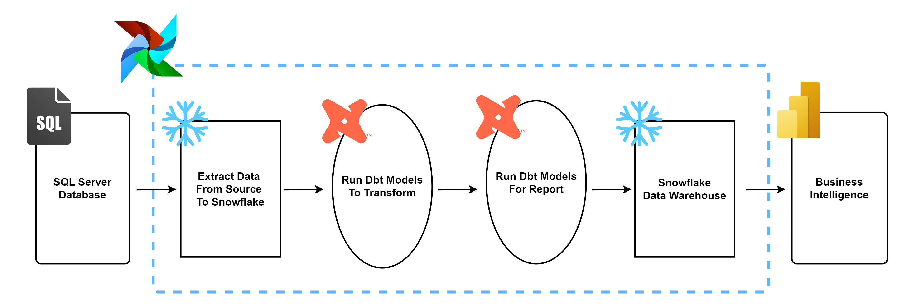
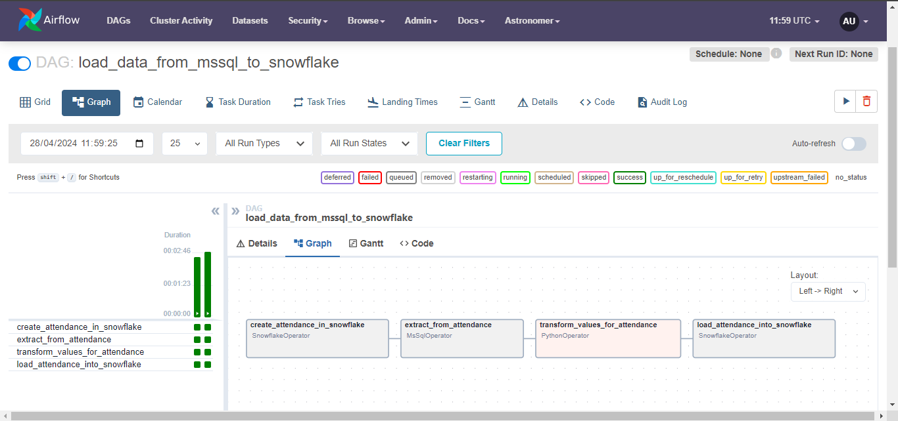
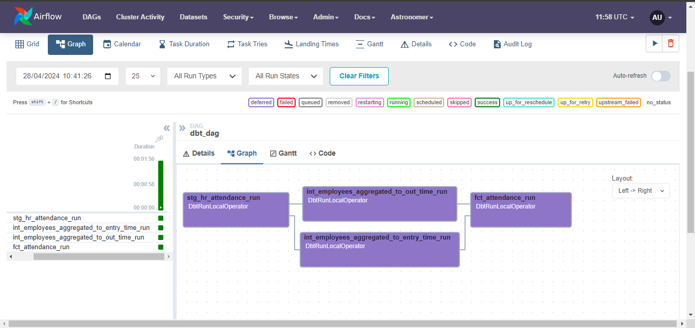
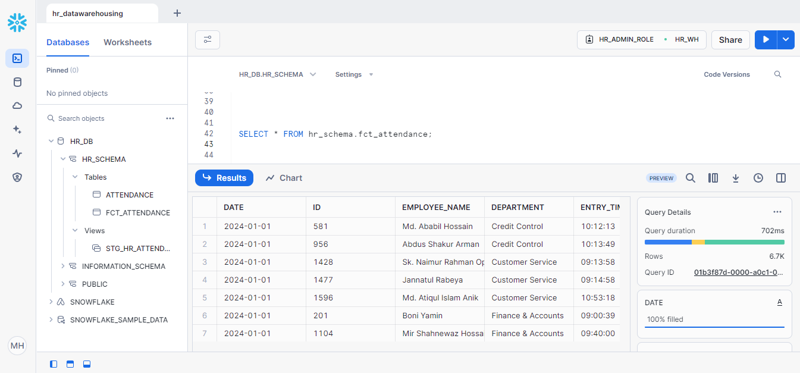
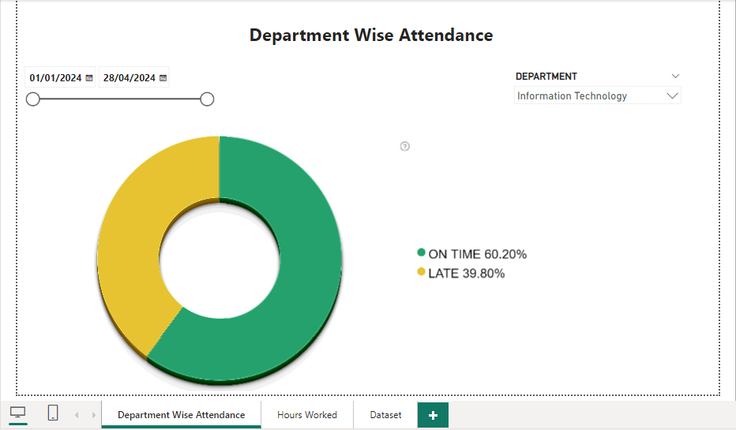
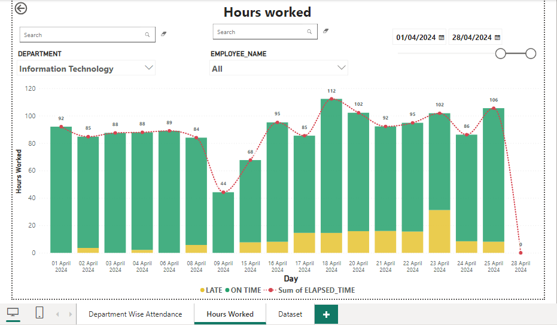

# HR Datawarehousing

This is a data warehousing project that implements a data pipeline which extracts data from sql server and loads it into snowflake data-warehouse and performs data transformations using dbt. To orchestrate these individual workflows I have used apache airflow.

Transformed data from snowflake is then used to explore the data visually through dashboards created with Power BI.

## Background: 
As a data analyst, I have done Human Resource Data Warehousing with SQL Server and performed data visualization
with PowerBI. From data warehousing to data modeling everything was done with sql server and orchestration was handled with SSIS(SQL SERVER INTEGRATION SERVICES). 


Now I want to achieve the same thing but trying modern technologies like dbt (transformations), snowflake (data-warehouse) and airflow (orchestration).

### Methodology:
- **E**xtract Data from source (sql server)
- **L**oad data from source to Snowflake (as staging tables), and 
- **T**ransform the loaded data into new dimensions models with dbt.

Lastly visualize the data model with PowerBI.

All of these jobs are orchestrated with airflow!

### Bonus: 
I have demonstrated here how to connect to an MSSQL database using Airflow.

A lot of goes under the hood in the dockerfile to establish a stable connection between MSSQL and Airflow. So anyone who is having problem connecting to a mssql database with airflow can greatly benefit from this project.

In brief, orchestrating a set of bash commands for installing odbc driver for sql server 18, and pyodbc in a dockerfile and spinning up a docker container based on the dockerfile and finally connecting a mssql database through pyodbc package with the help of odbc API does the trick.

## Project Architecture :

<p>
    
</p>


## ELT Flow:

#### Extract & Load Data:

<p>
    
</p>


The data we want to extract is employee attendance data which is stored in a microsoft sql server database.

This is an example of the source data we are extracting 👇
```bash
+------------+-------------+----------------------------+-----------+-----------------+-----------+--------------------+-----------------------------------------+----------------------+--------+
| serialNo   | employeeID  | authDateTime               | authDate  | authTime        | direction | deviceName         | deviceSerialNo                          | name                 | cardNo |
+------------+-------------+----------------------------+-----------+-----------------+-----------+--------------------+-----------------------------------------+----------------------+--------+
| 16         | 178         | 2024-01-01 09:02:11.0000000| 2024-01-01| 09:02:11.0000000| IN        | Banani Head Office | DS-K1T342EFWX20220310V030305ENK72672522 | Tamanna Sharmin      |        |
| 18         | 1056        | 2024-01-01 09:14:05.0000000| 2024-01-01| 09:14:05.0000000| IN        | Banani Head Office | DS-K1T342EFWX20220310V030305ENK72672522 | Sumon Al Mamun       |        |
| 20         | 1496        | 2024-01-01 09:15:26.0000000| 2024-01-01| 09:15:26.0000000| IN        | Banani Head Office | DS-K1T342EFWX20220310V030305ENK72672522 | Md. Samin Hyder      |        |
| 22         | 1362        | 2024-01-01 09:16:43.0000000| 2024-01-01| 09:16:43.0000000| IN        | Banani Head Office | DS-K1T342EFWX20220310V030305ENK72672522 | Md. Shamim Molla     |        |
| 24         | 1485        | 2024-01-01 09:20:51.0000000| 2024-01-01| 09:20:51.0000000| IN        | Banani Head Office | DS-K1T342EFWX20220310V030305ENK72672522 | Md. Monjurul Hossain |        |
+------------+-------------+----------------------------+-----------+-----------------+-----------+--------------------+-----------------------------------------+----------------------+--------+
```
An airflow dag is responsible for extracting data from source data, performing minor transformations such as type casting and loading it into a snowflake data warehouse.

First it creates a table having the same schema as its source table and then, begins the extraction job.


#### Transform Data:
As we progress through our ELT flow, for transformations there's another airflow dag which is responsible for running several dbt transformation jobs.
The dbt ``hr_data_pipeline`` project is structured like this 👇


    .
    ├── analyses                  
    ├── macros
    │   └── elapsed_time.sql
    ├── models
    │   ├── intermediate
    │   │   ├── int_employees_aggregated_to_entry_time.sql
    │   │   └── int_employees_aggregated_to_out_time.sql
    │   ├── marts
    │   │   └── fct_attendance.sql
    │   └── staging
    │       ├── sources.yml
    │       └── stg_hr_attendance.sql
    │ 
    ├── seeds                    
    ├── snapshots 
    ├── tests 
    ├── dbt_project.yml 
    └── README.md

##### Dbt workflow:

<p>
    
</p>


- Staging layer contains models which mirrors the recently loaded table in snowflake with minor model transformations such as renaming columns.
The staging layer serves as our foundation.
- Once our foundation is set up, we do purpose-built model transformations such as aggregating and grouping employee data.
These intermediate models are materialized ephemerally to keep our data warehouse minimal and less cluttered. 
- Our mart model brings intermediate models together by joining them into business-defined entities. This layers serves a specific entity like employee attendance results, their entry time and out time for the **Human Resource** Department.
Models in the marts layer are always materialized as tables for faster querying for reporting. 

## Business Intelligence

It is important to understand that, a data warehouse in essence is a data management system specifically designed to enable and support 
business intelligence (BI) activities, especially analytics.

To derive valuable business insights from this data to help take data-driven decisions. 

In this case, visual dashboards are useful enough to present easily understandable data analysis to stakeholders such as hr executives of a company. 


##### BI workflow:
- Snowflake data warehouse:
  <p>
      
  </p>

  At this stage of our project workflow, our hr data warehouse is complete. You can see that our dbt model in the marts layer has been materialized as a physical
  table in our Snowflake data warehouse.


- Purpose-built Dashboards:
  
  <p>
      
  </p>

  Such as displaying a bird's eye view of the employee data to understand which department is doing well in terms of on time and late attendance.
  Users can also customize his/her reports by filtering date range and departments.
  
  <p>
      
  </p>
  On the other hand, this interactive dashboard will be useful to understand how many hours an employee of a particular department has worked for a specific range of time.


## Environment Setup:

#### Setup SQL Server with Airflow

Prerequisites:
- sql server
- docker
- astro cli

Use astro cli to spin up an airflow environment with this command:
```
astro dev init
```
create a .env file and define your environment variables required for connecting SQL server with pyodbc 
```
# MSSQL env variables
SERVER=
USER=
PASSWORD=
DATABASE=

```
#### Install necessary dependencies for pyodbc and mssql

Refer to this [dockerfile](https://github.com/mahmudhasankhan/hr-datawarehousing/blob/master/sqlserver-snowflake-elt/Dockerfile).


```docker
FROM quay.io/astronomer/astro-runtime:10.5.0-python-3.10

USER root

RUN curl https://packages.microsoft.com/keys/microsoft.asc | sudo tee /etc/apt/trusted.gpg.d/microsoft.asc \
    && curl https://packages.microsoft.com/config/debian/11/prod.list | sudo tee /etc/apt/sources.list.d/mssql-release.list \
    && echo 'debconf debconf/frontend select Noninteractive' | debconf-set-selections \
    && sudo apt-get install -y -q \
    && sudo apt-get update \
    && sudo ACCEPT_EULA=Y apt-get install -y msodbcsql18 \
    && sudo ACCEPT_EULA=Y apt-get install -y mssql-tools18 \
    && echo 'export PATH="$PATH:/opt/mssql-tools18/bin"' >> ~/.bashrc \
    && source ~/.bashrc \
    && chmod +rwx /etc/ssl/openssl.cnf \
    && sed -i 's/TLSv1.2/TLSv1/g' /etc/ssl/openssl.cnf \
    && sed -i 's/SECLEVEL=2/SECLEVEL=1/g' /etc/ssl/openssl.cnf
USER airflow
```
These bash commands were curated from different sources like official documentations and mostly github issues and some stackoverflow questions etc. Yes, I haven't use chatgpt lol.


Basically, on steps where I have found obstacles, I have solved by reading through multiple documentations and github issues. I am listing down the resources down below.
- [Official Microsoft documentation on how to install odbc driver for linux](https://learn.microsoft.com/en-us/sql/connect/odbc/linux-mac/installing-the-microsoft-odbc-driver-for-sql-server?view=sql-server-ver16&tabs=debian18-install%2Calpine17-install%2Cdebian8-install%2Credhat7-13-install%2Crhel7-offline#18)
- [Error debconf: unable to initialize frontend: Dialog](https://github.com/moby/moby/issues/27988) (github issue)
- [pyodbc.OperationalError: likely because of openssl security level](https://github.com/mkleehammer/pyodbc/issues/610) (github issue)

Once this docker image build is done and airflow webserver has succesfully started, docker exec into the webserver by
```docker
docker exec -u root -it <container id> bash
```
and verify your connection by running 

```
isql -v -k "Driver={ODBC Driver 18 for SQL Server};Server=xx;Database=xx;UID=xx;PWD=xx;TrustServerCertificate=yes"
```
If you put the correct credentials right, your connection should be live. You can run a simple select query to check.

#### Pyodbc:

You can use this connection string for pyodbc in your dag to connect with a mssql server without the need of using any hooks.
```
connectionString = f'DRIVER={{ODBC Driver 18 for SQL Server}};SERVER={SERVER};DATABASE={DATABASE};UID={USERNAME};PWD={PASSWORD};TrustServerCertificate=yes'
```

Finally, run this [test dag](https://github.com/mahmudhasankhan/hr-datawarehousing/blob/master/sqlserver-snowflake-elt/dags/sqltest.py) to check everything works as it should between your MS SQL database and airflow.

### Connections in Airflow

#### ODBC Connection
Create an ODBC Connection in airflow with this values.

```
Connection id = mssql_default
Connection Type = ODBC
Host = 172.16.***.***
Schema = database 
Login = username
Password = ****
Port = 1433
Extra = {
  "ApplicationIntent": "ReadOnly",
  "TrustServerCertificate": "Yes",
  "connect_kwargs": {
    "autocommit": false,
    "ansi": true,
    "driver": "ODBC Driver 18 for SQL Server"
  }
}
```
#### Snowflake Connection
Create an Snowflake Connection in airflow with this values.
```
account: alwhqzt-xf04345
database: hr_db
password: **********
role: hr_admin_role
schema: hr_schema
threads: 10
type: snowflake
user: mahmudhasankhan
warehouse: hr_wh
```
Upon setting up these connections,[sqlserver_to_snowflake](https://github.com/mahmudhasankhan/hr-datawarehousing/blob/master/sqlserver-snowflake-elt/dags/sqlserver_to_snowflake.py) dag will be runnable.


### Install & setup dbt

You need to install dbt-core and dbt-snowflake adapter in your local machine.

Run these commands in your bash terminal.
```bash
pip install dbt-core \

&& pip install dbt-snowflake
```
Configure your dbt profiles.yml file. My profiles.yml file looks like this. Fill the required credentials.

```
hr_data_pipeline:
  outputs:
    dev:
      account: snowflake-account 
      database: snowflake-database 
      password: password 
      role: snowflake-role 
      schema: snowflake-schema 
      threads: 10
      type: snowflake
      user: username 
      warehouse: snowflake-warehouse 
  target: dev

```
Then, cd into your dbt project folder and run `dbt debug`. If you've correctly configured your profiles.yml file then all checks will pass.
### Setup Snowflake Environment

In snowflake we're gonna create a datawarehouse from where we'll visualize data later.
For datawarehousing, we will create a database and a role. We will also define a schema where we will put our dbt-tables (staging tables & data marts, fact tables) in.


**Snowflake warehouse:** A virtual warehouse, often referred to simply as a “warehouse”, is a cluster of compute resources in Snowflake.
A warehouse provides the required resources, such as CPU, memory, and temporary storage, to perform operations in a Snowflake session.

**Database & Schema**: All data in Snowflake is maintained in databases. Each database consists of one or more schemas, which are logical groupings of database objects, such as tables and views.

**Views**: A view allows the result of a query to be accessed as if it were a table. 

A view is a defined query that sits on top of a table. Unlike a table, it doesn't store the actual data. It always contains the latest data because it reruns every time it is queried. Whereas a table is only as fresh as the last time it was created or updated, no matter when you query it.

Run the following commands in your snowflake sql worksheet
```sql
USE ROLE ACCOUNTADMIN;

CREATE WAREHOUSE hr_wh WITH warehouse_size='x-small';

CREATE DATABASE IF NOT EXISTS hr_db;

CREATE ROLE IF NOT EXISTS hr_admin_role;

SHOW GRANTS ON WAREHOUSE hr_wh;


GRANT usage ON WAREHOUSE hr_wh TO ROLE hr_admin_role;

GRANT ROLE hr_admin_role TO USER mahmudhasan141;
    
GRANT ALL ON DATABASE hr_db TO ROLE hr_admin_role;

GRANT MANAGE GRANTS on account to role hr_admin_role;

USE ROLE hr_admin_role;

CREATE SCHEMA hr_db.hr_schema;

-- to drop your database and warehouse
use role accountadmin;
drop IF EXISTS warehouse hr_wh;
drop IF EXISTS database hr_db;
drop role IF EXISTS hr_admin_role;
```

### Install & Setup PowerBI

Install Power BI in your machine, its a straight forward process. Then get data from snowflake
using your snowflake account url and mentioning your datawarehouse. 

